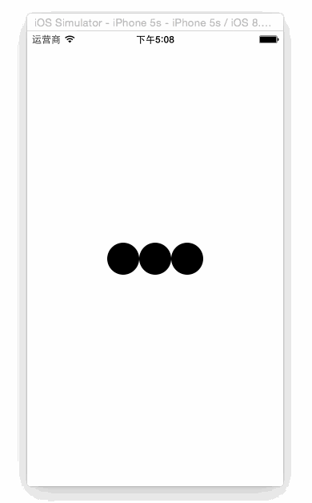

# KYNewtonCradleAnimiation
牛顿摆动画

已经封装成HUD.




##How to use?

Step1: `#import "KYLoadingHUD.h"`

Step2: Initiate
```
    hud = [[KYLoadingHUD alloc]initWithFrame:CGRectMake(self.view.bounds.size.width / 2 - 50, self.view.bounds.size.height / 2 -100, 100, 100)];
    [self.view addSubview:hud];
    [hud showHUD]; // 显示

```

在取消隐藏的地方：
`[hud dismissHUD];`


ENJOY!
